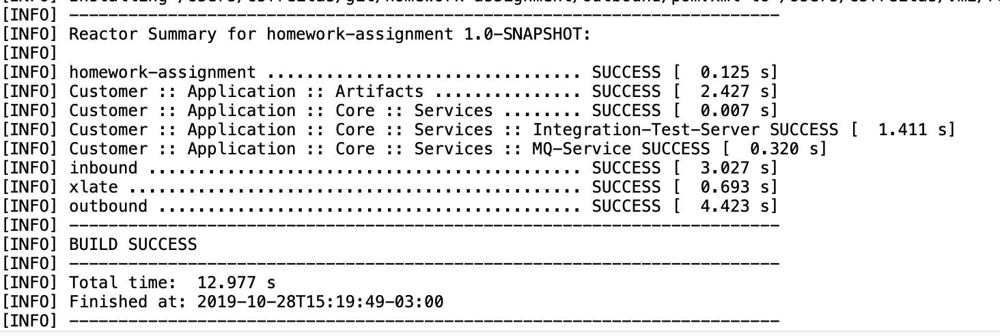

# Agile - Homework Assigment


This project is for an assigment of the course ***Advanced Agile Integration with Red Hat Fuse***.

## Improvements

For simplify the way we deliver the solution, use less configuration files, we have made some improvements in the original source of the homework assigment:

- Removal of some project folder that is not necessary anymore(because of the restructuring of the project):
  - *processors*
  - *customer-features*
- Usage of SpringBoot technology with embedded server.
- Comment the maven plugins generators from project ***artifacts*** project after execution of the generate-sources phase em get the java code based on provided archives(wsdl,xsd), moved it to ***src*** folder to create ***custom-artifacts***  jar module.
- Rename artifactId from artifacts project to ***custom-artifacts*** after generate-sources execution, packaging in jar module to compile the others modules.
- Change package ***com.customer.app*** to ***com.redhat.app*** to differentiate from original homework source
- Unique *parent* pom.xml

## Build

To build the project:

```shell
cd /
mvn clean package
```

Verify:



## Pre-Running

To run the match test we gona need **Red Hat AMQ** and **Red Hat Fuse running in Apache Karaf** in standalone mode for the integration test server project.

### Run Red Hat AMQ

> For installation and some basic configuration see ***[documentation](https://access.redhat.com/documentation/en-us/red_hat_amq/7.4/html/getting_started_with_amq_broker/installing-broker-getting-started)***.

In a terminal:

```shell
cd $AMQ_HOME/instances/mybroker/bin
./artemisn run
```

Wait some time and verify that AMQ is running:

- http://localhost:8161/console/login

Use the admin user that you defined during installation.

### Run Red Hat Fuse

> For installation and some basic configuration see red hat FUSE ***[documentation](https://access.redhat.com/documentation/en-us/red_hat_fuse/7.4/html-single/installing_on_apache_karaf/index)***.

In a terminal:

```shell
cd $FUSE_HOME/bin
sh fuse

###
Open a browser to http://localhost:8181/hawtio to access the management console
```

Use the admin user that you defined during installation in ***etc/users.properties*** to access the management console.

### Deploy integration-test-server

After Red Hat FUSE is running on Apache Karaf, we have to deploy a test web service provided by the service maven project called **integration-test-server**.

This project was build using OSGi framework and thats why we gonna use apache karaf to help us running it.

Because we change the way that artifacts projects was build, we need to install the jar from custom-artifacts using a wrapper that gonna convert the jar into a bundle module project inside the apache karaf. So after buit the custom-artifacts maven artifact, during the build phase of the parent pom, we have to execute this commands:

Inside karaf command console:

```shell
osgi:install -s wrap:mvn:com.redhat.app/custom-artifacts/1.0-SNAPSHOT
```

The step upward is it necessary because when we will start the web service in karaf, the project is gonna ask the model that was generated based on xsds and wsdls inside artifact project.

After installation of the module we can continue:

```shell
osgi:install mvn:com.redhat.app/integration-test-server/1.0-SNAPSHOT
### this command wil print the bundle id so:
osgi:start <bundle_id>
```

 After start *integration-test-server* we can test if the web service is running:

```shell
## Open in browser to see the web service definitions:
http://localhost:8181/cxf/PersonEJBService/PersonEJB?wsdl
```

## Running

To simplify, each project there are it ***server.port*** property configured like:

- inbound -> 8080
- xlate -> 8082
- outbound -> 8084

> ***OBS:*** If you want to change some configurations you can edit the ***application.yml*** of each project, for development purpose. and local executions.

Running **inbound**,**xlate** and **outbound** projects:

```shell
cd inbound
mvn spring-boot:run 
cd ../xlate
mvn spring-boot:run 
cd ../outbound
mvn spring-boot:run 
```

> To verify applications configurations go to ***src/main/resources*** folder and see file ***application.yml*** of each project

After all project has started you can test it.

## Testing

To test the solution you can use ***[postman](https://www.getpostman.com/)***, there is a collection of request for test the match inside the postman folder.